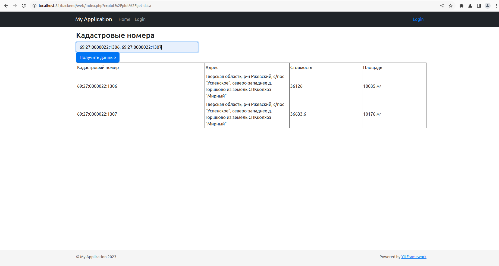

Инструкция по разворачиванию проекта

1. Клонировать проект с репозитория git clone https://github.com/sub3er0/gektar.git .
2. Установить yii2 (cd app) composer install
3. docker compose up -d
4. docker exec -it gektar_php bash Затем выполнить команду инициализации проекта php init
5. sudo chmod -R 777 . из корня проекта
6. В файле app/common/config/main-local.php установить правильные доступы:
```
   'db' => [
   'class' => \yii\db\Connection::class,
   'dsn' => 'mysql:host=db;dbname=dbname',
   'username' => 'username',
   'password' => 'password',
   'charset' => 'utf8',
   ],
```
7. Выполнить php yii migrate
8. Страница веб сервиса доступна по адресу http://localhost:81/backend/web/index.php?r=plot/plot

Код находится в модуле по пути app/backend/modules/plot

Как пользоваться:
После открытия страницы plot/plot необходимо в инпут Кадастровые номера ввести через запятую кадастровые номера, в результате
выведется таблица с информацией, логика работы соответствует ТЗ.


